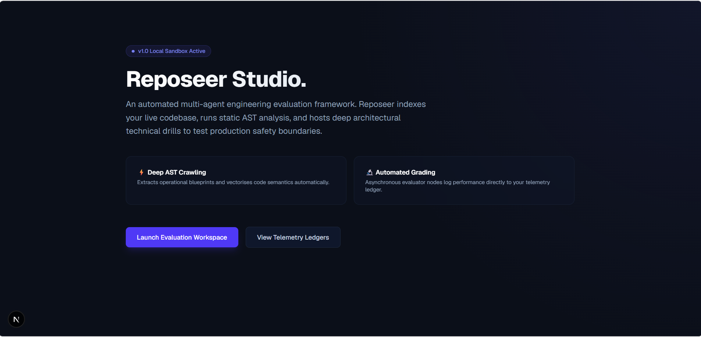
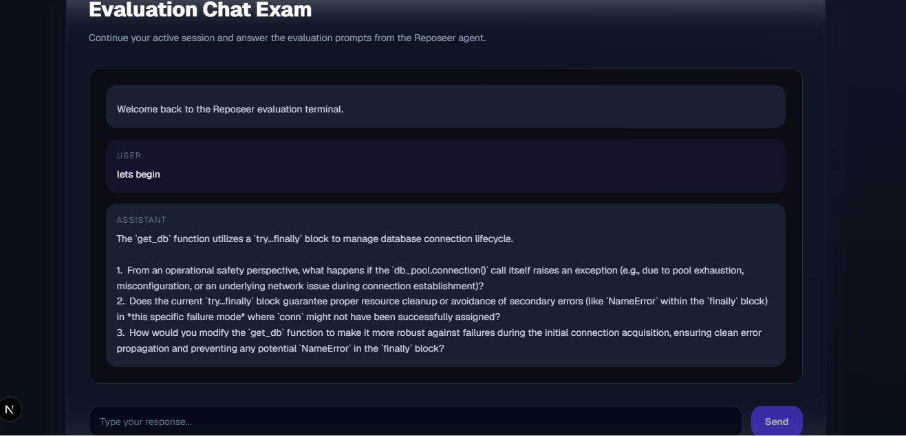

# 🔬 Reposeer Studio

Reposeer Studio automatically analyzes software repositories to generate architecture-aware engineering interviews. Instead of asking generic algorithmic puzzles, it inspects real source code, understands the application's architecture, and produces technical evaluations grounded in production implementation details.

[](https://fastapi.tiangolo.com/)
[](https://nextjs.org/)
[](https://tailwindcss.com/)
[](https://opensource.org/licenses/MIT)

---

# 👁️ Preview

### Dashboard



### Live Evaluation Session



---

# 🎯 Why Reposeer?

Traditional technical interviews often evaluate isolated algorithmic problems rather than a developer's ability to understand, navigate, and maintain production software.

Reposeer Studio takes a different approach. It analyzes a real codebase, understands its architecture, and generates technical discussions based on actual implementation details. This creates engineering evaluations that are far more representative of real-world software development.

---

# ⚡ Current Capabilities

- Analyze Python repositories
- Parse source code into Abstract Syntax Trees (ASTs)
- Extract architectural and dependency information
- Generate architecture-aware interview questions
- Evaluate engineering responses using AI agents
- Persist interview sessions with checkpoint recovery
- Display evaluation telemetry and performance metrics

---

# ✨ Core Features

- 🤖 **Context-Aware Technical Drills** – Generates interview questions directly from the candidate's code instead of relying on generic templates.
- 🧩 **Static AST Parsing** – Crawls repositories, maps dependencies, and identifies potential production risks before evaluation begins.
- 📡 **Stateful Session Checkpointing** – Saves evaluation progress asynchronously, allowing interrupted sessions to resume safely.
- 🔄 **Idempotent Session Reset** – Detects previously analyzed repositories, reloads recent paths, and allows clean re-analysis when required.
- 🎨 **Modern Developer Experience** – Glassmorphic dark-themed interface built for readability, telemetry visualization, and productivity.

---

# 🛠️ Technology Stack

| Layer | Technology | Purpose |
| :--- | :--- | :--- |
| **Frontend** | Next.js, React, TypeScript | Interactive Developer Workspace |
| **Styling** | Tailwind CSS | Glassmorphic UI |
| **Backend** | FastAPI, Uvicorn | Async REST API |
| **AI Orchestration** | LangGraph | Multi-Agent Coordination |
| **LLM** | Gemini / OpenAI | Interview Generation & Evaluation |
| **Database** | PostgreSQL | Session & Telemetry Storage |
| **Connection Pooling** | DBUtils (`PooledDB`) | Thread-safe Database Connections |
| **Code Analysis** | Python `ast` | Static Repository Analysis |

---

# 📉 Evaluation Pipeline

Every repository follows the same analysis pipeline before interview generation.

```text
                      Target Repository
                              │
                              ▼
                   ┌─────────────────────┐
                   │   File Discovery    │
                   └──────────┬──────────┘
                              │
                              ▼
                   ┌─────────────────────┐
                   │    AST Parsing      │
                   └──────────┬──────────┘
                              │
                              ▼
                   ┌─────────────────────┐
                   │ Semantic Extraction │
                   └──────────┬──────────┘
                              │
                              ▼
                   ┌─────────────────────┐
                   │ Architecture Graph  │
                   └──────────┬──────────┘
                              │
                              ▼
                   ┌─────────────────────┐
                   │ Question Generation │
                   └──────────┬──────────┘
                              │
                              ▼
                   ┌─────────────────────┐
                   │ Interview Session   │
                   └──────────┬──────────┘
                              │
                              ▼
                   ┌─────────────────────┐
                   │ Structured Scoring  │
                   └──────────┬──────────┘
                              │
                              ▼
               Analytics Dashboard & Telemetry
```

---

# 🏗️ System Architecture

Reposeer separates repository analysis, AI orchestration, persistence, and visualization into isolated components.

```text
┌──────────────────────────────────────────────────────────────────────────────┐
│                          Next.js Frontend Client                             │
│                 Workspace • Chat • Metrics • Telemetry UI                    │
└───────────────────────────────────┬──────────────────────────────────────────┘
                                    │
                              HTTP / WebSocket
                                    │
                                    ▼
┌──────────────────────────────────────────────────────────────────────────────┐
│                           FastAPI Application Core                           │
│             API Routes • Session Manager • Repository Controller             │
└──────────────────────┬──────────────────────────────┬────────────────────────┘
                       │                              │
                       ▼                              ▼
             ┌────────────────┐          ┌────────────────────────┐
             │   PostgreSQL   │          │   LangGraph Workflow   │
             │ Session Storage│          └───────────┬────────────┘
             └────────────────┘                      │
                                                     │
                         ┌───────────────────────────┴──────────────────────────┐
                         ▼                                                      ▼
             ┌────────────────────────┐                          ┌────────────────────────┐
             │     Router Agent       │                          │    Evaluator Agent     │
             │ AST Parsing & Context  │                          │ Technical Assessment   │
             └────────────────────────┘                          └────────────────────────┘
```

---

# 📂 Project Structure

```text
reposeer-core/
│
├── backend/
│   ├── agents/           # LangGraph agents
│   ├── analyzer/         # AST parser & repository analysis
│   ├── api/              # FastAPI endpoints
│   ├── evaluation/       # Evaluation framework
│   └── app.py            # Application entry point
│
├── studio/
│   ├── app/              # Next.js routes
│   ├── components/       # UI components
│   ├── hooks/            # Custom React hooks
│   └── lib/              # Shared utilities
│
├── docs/
│   └── images/
│
└── README.md
```

---

# 🚀 Getting Started

## 📦 Prerequisites

- Python 3.11+
- Node.js 18+
- PostgreSQL

---

## 🛠️ Backend Setup

Clone the repository and navigate to the backend.

```bash
cd reposeer-core
```

Create a virtual environment.

```bash
python -m venv venv
```

Activate it.

**Windows (PowerShell)**

```powershell
.\venv\Scripts\Activate.ps1
```

**Linux / macOS**

```bash
source venv/bin/activate
```

Install dependencies.

```bash
pip install -r requirements.txt
```

Start the backend server.

```bash
python app.py
```

---

## 🎨 Frontend Setup

Navigate to the frontend.

```bash
cd studio
```

Install dependencies.

```bash
npm install
```

Start the development server.

```bash
npm run dev
```

Open:

```text
http://localhost:3001
```

---

# 📝 Code Analysis Example

During repository analysis, Reposeer examines production-critical patterns such as database connection management.

```python
def get_db():
    # Prevent UnboundLocalError during connection failures.
    conn = None

    try:
        conn = db_pool.connection()
        yield conn

    except OperationalError as err:
        logger.critical(f"Database Acquisition Failure: {err}")
        raise HTTPException(
            status_code=503,
            detail="Database Offline"
        )

    finally:
        if conn is not None:
            conn.close()
```

The evaluator inspects implementations like this to determine whether resources are released correctly, exceptions are handled safely, and production best practices are followed.

---

# 🗺️ Roadmap

- [x] Repository ingestion
- [x] AST parsing
- [x] Architecture extraction
- [x] Multi-agent orchestration
- [x] Stateful session checkpointing
- [ ] TypeScript repository support
- [ ] Go repository support
- [ ] Docker deployment
- [ ] Team workspaces
- [ ] PDF evaluation reports

---

# 📄 License

Distributed under the MIT License. See the `LICENSE` file for more information.

---

Built using **FastAPI**, **LangGraph**, **Next.js**, **Tailwind CSS**, and **PostgreSQL**.
